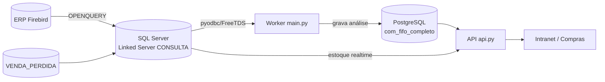

# Análise de Estoque — Serviço

Serviço de análise de estoque e **sugestão de compra** da AC Acessórios. Roda
semanalmente, lê o histórico do ERP, calcula para cada produto o **estoque
mínimo (ponto de pedido)** e o **máximo (nível de reposição)**, e expõe os
resultados por uma API consumida pela intranet.

A ideia central: **cada produto vende de um jeito** (uns todo dia, outros "aos
soluços", outros com estação), então o serviço não usa uma fórmula única — ele
escolhe o método estatístico certo para o comportamento de cada item, consolida
a demanda entre as marcas do mesmo produto, e devolve números prontos para o
comprador.

---

## Índice

1. [Arquitetura](#1-arquitetura)
2. [Metodologia de cálculo](#2-metodologia-de-cálculo)
3. [Modelo de dados](#3-modelo-de-dados)
4. [Configuração (variáveis de ambiente)](#4-configuração-variáveis-de-ambiente)
5. [Como rodar](#5-como-rodar)
6. [API](#6-api)
7. [Integração com Compras](#7-integração-com-compras)
8. [Operação e manutenção](#8-operação-e-manutenção)
9. [Glossário](#9-glossário)

---

## 1. Arquitetura

Dois processos a partir do mesmo código:

- **Worker** (`main.py`): job semanal de cálculo (pesado). Lê o ERP, processa e
  grava no PostgreSQL.
- **API** (`api.py`, FastAPI/uvicorn): serve os resultados (somente leitura) e
  cruza com estoque em tempo real do ERP.



- **Origem (ERP):** Firebird, acessado via **SQL Server** (linked server
  `CONSULTA`) por `OPENQUERY`. Tabelas lidas: `lanctos_estoque` (vendas/entradas),
  `nfs_itens` (devoluções), `produtos`/`marcas`/`fornecedores`/`produtos_subgrupos`
  (cadastro/saldo) e `venda_perdida` (demanda perdida no balcão).
- **Destino (análise):** PostgreSQL, tabela `com_fifo_completo` (uma linha por
  produto, atualizada a cada execução) + tabelas auxiliares.
- **Compras:** a API lê o módulo de compras no PostgreSQL (`com_pedido`,
  `com_pedido_itens`, `com_pedido_nfe_vinculo*`) para calcular o "em trânsito".

> ⚠️ A nuvem não alcança a intranet diretamente; o worker roda onde alcança o
> SQL Server. A conexão Postgres normaliza `postgres://` → `postgresql://`.

---

## 2. Metodologia de cálculo

### 2.1 Demanda real = vendas + venda perdida

A demanda é medida nos **últimos 12 meses** (`JANELA_DEMANDA_MESES`), não na
média histórica. Sobre as vendas faturadas soma-se a **venda perdida**
(`VENDA_PERDIDA`) — a procura que não virou venda por falta de estoque. Isso
corrige a **demanda censurada** (quando falta produto, a venda registrada
subestima a procura). Cada apontamento de venda perdida tem **teto por evento**
(`VP_CAP_*`) para um lançamento atípico não distorcer.

### 2.2 Classificação

- **Curva ABC** — por valor vendido em 12 meses: A (≤70% do faturamento
  acumulado), B (≤90%), C (≤97%), D (resto). Define o **nível de serviço**.
- **Classe XYZ** — pelo coeficiente de variação (CV) da demanda mensal:
  X (≤`XYZ_LIMIAR_X`), Y (≤`XYZ_LIMIAR_Y`), Z (acima). Item sem giro fica nulo.
- **Padrão de demanda (Syntetos-Boylan-Croston)** — por **ADI** (intervalo médio
  entre vendas, em meses) e **CV²** (variação do tamanho da venda):

  | | CV² baixo (`<SBC_CV2`) | CV² alto |
  |---|---|---|
  | **ADI baixo** (`<SBC_ADI`) | **Suave** | **Errático** |
  | **ADI alto** | **Intermitente** | **Grumoso** |

### 2.3 Os três cálculos

Todos usam o **nível de serviço da curva** (probabilidade de não faltar):
A=98% (Z≈2,05), B=95% (1,65), C=90% (1,28), D=85% (1,04).

**Cálculo 1 — Normal (Silver-Pyke)** — itens Suave/Errático:

```
SS  = Z × σ × √LT
Mín = d × LT + SS
Máx = Mín + d × C
```
`d`=demanda diária · `LT`=lead time · `σ`=desvio-padrão diário · `Z`=fator da
curva · `C`=dias de ciclo da classe · `SS`=estoque de segurança (teto de
`SS_CAP_CICLOS` ciclos).

**Cálculo 2 — Poisson composta** — itens Intermitente/Grumoso (vendem em lote):

```
λ          = d × dias                  (dias = LT no mínimo; LT+C no máximo)
dispersão  = lote × (1 + CV²)          (variância ÷ média)
Mín / Máx  = menor k com P(demanda ≤ k) ≥ nível de serviço
```
`dispersão`≈1 → **Poisson**; `dispersão`>1 → **Binomial Negativa**. A taxa usa a
correção de viés de **Croston/SBA** (`ALPHA_CROSTON`). Isso evita o
superdimensionamento de quando se usava a σ mensal direto.

**Cálculo 3 — Sazonalidade** — subgrupos com onda anual confiável:

```
índice(mês)        = venda média do mês ÷ venda média geral   (vários anos)
demanda planejada  = d × índice (do período à frente = LT + ciclo)
```
Só vale quando o pico se repete no mesmo trimestre (`SAZ_CONSIST_MIN`), com
amplitude (`SAZ_AMPLITUDE_MIN`) e volume (`SAZ_VOL_MIN`) mínimos. O fator é
travado em `[SAZ_FATOR_MIN, SAZ_FATOR_MAX]` e **multiplica a demanda antes** dos
cálculos 1/2.

### 2.4 Consolidação por grupo (marcas) + originais

O cálculo é por **grupo de produto** = mesma **descrição** (a marca fica no
`mar_codigo`). Como o cliente leva qualquer marca, a demanda das marcas é
**consolidada** (substitutos): junta-se a série mensal de todas as marcas e
roda-se o motor **uma vez por grupo**. Benefício (risk pooling + mudança de
padrão): o ponto de pedido do grupo é bem menor que a soma dos individuais.

**Produtos originais** (marca montadora/genuíno) ficam **"Sob Encomenda"**:
sem mínimo/máximo e **fora da demanda do grupo** (compra por pedido real). Regra
(`marca_eh_original`): marca contém `ORIGINAL`/`GENUINO`, **menos** as exceções
aftermarket (`MARCAS_ORIGINAL_EXCECOES`, ex.: `ORIGINAL PARTS`, `DRIFT`).

### 2.5 FIFO e idade do saldo

Em paralelo, o serviço reconstrói por **FIFO** de quais entradas é composto o
estoque atual, calcula a **idade média** do saldo e classifica
(Rápido/Médio/Lento/Obsoleto) — usado para girar/promover estoque parado. Os
lotes residuais ficam em `com_data_saldo_produto`.

---

## 3. Modelo de dados

Tabela principal **`com_fifo_completo`** (uma linha por produto por execução;
mantém as 2 últimas execuções). Colunas por grupo:

| Grupo | Colunas |
|---|---|
| Identidade | `pro_codigo`, `pro_descricao`, `pro_referencia`, `mar_descricao`, `sgr_codigo`, `sgr_descricao`, `fornecedor1..3`, `estoque_disponivel` |
| Demanda | `demanda_media_dia`, `demanda_real_dia`, `demanda_media_dia_ajustada`, `demanda_planejamento_dia`, `sigma_demanda_dia`, `venda_perdida_12m`, `valor_vendido_12m`, `dias_ruptura` |
| Classificação | `curva_abc`, `classe_xyz`, `cv_demanda`, `padrao_demanda`, `metodo_reposicao`, `categoria_estocagem` |
| Tendência/Sazonal | `fator_tendencia`, `tendencia_label`, `alerta_tendencia_alta`, `fator_sazonal` |
| Mín/Máx (item) | `estoque_min_base/max_base`, `estoque_min_ajustado/max_ajustado`, **`estoque_min_sugerido`/`estoque_max_sugerido`**, `estoque_seguranca`, `nivel_servico_z`, `lead_time_dias`, `tipo_planejamento` |
| **Grupo** | `grupo_chave`, `grupo_qtd_itens`, `grupo_estoque_disponivel`, `grupo_demanda_dia`, `grupo_fator_sazonal`, `grupo_curva`, `grupo_padrao`, `grupo_metodo`, **`grupo_estoque_min`/`grupo_estoque_max`**, `grupo_estoque_seguranca` |
| Flags | `sob_encomenda`, `teve_alteracao_analise`, `dados_alteracao_json`, `data_processamento` |
| FIFO saldo | `tempo_medio_saldo_atual`, `categoria_saldo_atual` |

Auxiliares:
- **`com_relacionamento_itens`** (`group_id`, `pro_codigo`) — grupos de similares
  (auto por descrição idêntica + ajustes manuais via API).
- **`com_data_saldo_produto`** — lotes residuais FIFO do estoque atual.

> O DDL é **idempotente**: `criar_tabela_postgres()` cria a tabela e adiciona as
> colunas novas (`ALTER ... IF NOT EXISTS`) automaticamente na 1ª execução.

---

## 4. Configuração (variáveis de ambiente)

### Conexão e gerais
| Variável | Padrão | Descrição |
|---|---|---|
| `POSTGRES_URL` | (obrigatório) | conexão SQLAlchemy do PostgreSQL de destino |
| `SQL_HOST` / `SQL_PORT` | `127.0.0.1` / `1433` | SQL Server (linked server CONSULTA) |
| `SQL_DATABASE` / `SQL_USER` / `SQL_PASSWORD` | `master` / `sa` / — | credenciais SQL Server |
| `SQL_DRIVER` / `TDS_VERSION` | `{FreeTDS}` / `7.4` | driver ODBC e versão TDS |
| `INTERVALO_DIAS` | `7` | intervalo do job |
| `EMAIL_*` | — | SMTP do relatório (server/port/sender/password/receiver) |

### Parâmetros do modelo
| Variável | Padrão | Descrição |
|---|---|---|
| `JANELA_DEMANDA_MESES` | `12` | janela da demanda e do ABC |
| `LEAD_TIME_DIAS` | `17` | prazo de reposição (dias) |
| `Z_CURVA_A/B/C/D` | `2.054/1.645/1.282/1.036` | fator Z por curva (Normal) |
| `NS_CURVA_A/B/C/D` | `0.98/0.95/0.90/0.85` | nível de serviço (Poisson) |
| `SS_CAP_CICLOS` | `1.0` | teto do SS em ciclos (0 = sem teto) |
| `XYZ_LIMIAR_X/Y` | `0.5/1.0` | limiares do CV para X/Y/Z |
| `SBC_ADI` / `SBC_CV2` | `1.32/0.49` | limiares do padrão de demanda |
| `ALPHA_CROSTON` | `0.1` | suavização Croston/SBA |
| `VP_CAP_MULT/PISO/TETO` | `3.0/5.0/200.0` | cap por evento da venda perdida |
| `SAZ_ANOS` | `5` | anos completos para o índice sazonal |
| `SAZ_AMPLITUDE_MIN` / `SAZ_VOL_MIN` / `SAZ_CONSIST_MIN` | `1.5/300/0.6` | critérios de sazonalidade confiável |
| `SAZ_FATOR_MIN/MAX` | `0.5/2.0` | trava do fator sazonal |
| `MARCAS_ORIGINAL_EXCECOES` | `DECAL LINE,DRIFT,INDUSTRIA ORIGINAL,ORIGINAL PARTS` | marcas aftermarket que contêm "original" no nome mas **não** são encomenda |

---

## 5. Como rodar

### Docker (produção / EasyPanel)
```bash
docker build -t analise-estoque .
docker compose up -d        # ver docker-compose.yml (worker + api)
```
A imagem copia apenas `requirements.txt`, `main.py` e `api.py`. As variáveis de
ambiente vêm do EasyPanel/compose (o `.env` é só para execução local e não entra
na imagem).

### Local (desenvolvimento)
Pré-requisitos: driver ODBC SQL Server / FreeTDS. Depois:
```bash
pip install -r requirements.txt

python main.py run       # executa o job uma vez (cria colunas + grava análise)
python main.py create    # apenas cria/atualiza as tabelas (DDL)
python main.py check     # inspeciona a tabela (contagem, última execução)
python main.py           # inicia o serviço em loop (agendado: domingo 14h)

uvicorn api:app --host 0.0.0.0 --port 8000   # sobe a API
```

> **1º deploy:** rode `python main.py run` (cria as colunas novas e grava a
> análise) e então suba a `api.py`.

---

## 6. API

Base FastAPI (docs interativas em `/docs`). Principais rotas:

| Método | Rota | Função |
|---|---|---|
| GET | `/analise` | lista paginada da análise (filtros: curva, padrão, status, busca, grupo, simulação por cobertura, estoque realtime) |
| GET | `/analise/export` | exporta a análise (Excel) |
| POST | `/analise/simular` | simulação de grupo ad-hoc (cobertura em dias) |
| **GET** | **`/compras/sugestao`** | **lista de compra por fornecedor (ver §7)** |
| GET | `/subgroups` · `/brands` · `/categories` | listas para filtros |
| POST | `/similar/group` · DELETE `/similar/ungroup` | montar/desfazer grupos de similares |
| POST | `/similar/recalc` · `/similar/auto-group` | recalcular/auto-agrupar grupos |
| POST | `/promo/plan` · `/promo/export` | itens com excesso para promoção/giro |
| GET | `/health` | healthcheck |

---

## 7. Integração com Compras

A reposição é um modelo **(mínimo, máximo)** = (s, S): ao cair no mínimo,
compra-se até o máximo. A regra usa a **posição**, não só o estoque físico:

```
Posição  = estoque atual (ERP, tempo real)  +  em trânsito (pedidos em aberto)
Comprar? = Posição ≤ ponto de pedido (mínimo)
Quanto?  = Máximo − Posição
```

**`GET /compras/sugestao`** devolve isso **agrupado por fornecedor**:
- **Em trânsito** = `com_pedido` com status `Liberado`/`Em Trânsito parcialmente`,
  somando `com_pedido_itens.quantidade` menos o já recebido
  (`com_pedido_nfe_vinculo_item.quantidade_alocada`, vínculo confirmado).
- **Estoque** em tempo real (uma query única ao ERP).
- Filtros: `fornecedor`, `curva`, `apenas_zerados`, `usar_estoque_realtime`.
- Tolerante a schema antigo (colunas novas viram `NULL` se ainda não existem).

> Para produtos agrupados, a tela deve usar `grupo_estoque_min/max` e a posição
> consolidada das marcas, e **omitir os `sob_encomenda`**.

---

## 8. Operação e manutenção

- **Agendamento:** loop interno roda o job aos **domingos às 14h** (estado em
  `data/fifo_service_state.json`). Em produção pode ser disparado por cron/EasyPanel.
- **Retenção:** mantém as **2 últimas execuções** em `com_fifo_completo`
  (compara a atual com a anterior e marca `teve_alteracao_analise`).
- **Relatório:** ao fim do job, envia e-mail com resumo + Excel de backup
  (`enviar_email_relatorio`) se `EMAIL_*` estiver configurado.
- **Auto-agrupamento:** ao fim, agrupa produtos de descrição idêntica em
  `com_relacionamento_itens`.
- **Tuning:** todos os parâmetros do §4 são ajustáveis por env sem mexer no
  código. A análise é recalculada semanalmente.

---

## 9. Glossário

| Termo | Significado |
|---|---|
| **Ponto de pedido (mínimo)** | nível de estoque que dispara a compra |
| **Máximo / order-up-to** | nível até onde se repõe |
| **Lead time (LT)** | prazo entre pedir e receber |
| **Estoque de segurança (SS)** | colchão contra a variação da demanda |
| **Nível de serviço** | probabilidade de não faltar (define Z / a meta) |
| **Demanda censurada** | procura subestimada por falta de estoque (corrigida pela venda perdida) |
| **ADI / CV²** | esparsidade da venda / variação do tamanho da venda |
| **Risk pooling** | ganho de consolidar a demanda de itens substitutos |
| **Sob Encomenda** | produto original (montadora/genuíno) comprado por pedido, não estocado |

---

*Serviço de Análise de Estoque — AC Acessórios. Motor em `main.py`
(`calcular_metricas_e_classificar`), API em `api.py`.*
